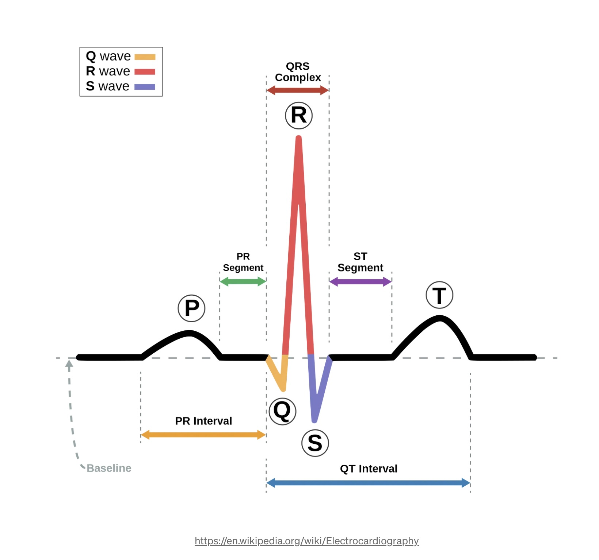
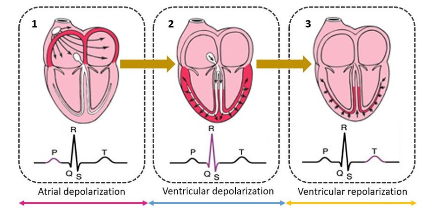

# Week 1: 

## Session 1: Data 

### Data: 
- [AF Classification from a Short Single Lead ECG Recording: The PhysioNet/Computing in Cardiology Challenge 2017](https://physionet.org/content/challenge-2017/1.0.0/)
- "ECG recordings were sampled as **300 Hz** and they have been **band pass filtered** by the **AliveCor** device."
- Device: [Alivcor](https://store.alivecor.co.uk/?gad_source=1&gclid=CjwKCAiArLyuBhA7EiwA-qo80HxOCro93qMFtW_DABH98VWJKY10lusHDQhqD_wbNP6uivWjwkjNoRoC91gQAvD_BwE)
- Single lead ECG 
- Atrial fibrillation 



[Hardware Architecture for Adaptive Dual Threshold Filter and Discrete Wavelet Transform based ECG Signal Denoising](https://www.researchgate.net/publication/356826618_Hardware_Architecture_for_Adaptive_Dual_Threshold_Filter_and_Discrete_Wavelet_Transform_based_ECG_Signal_Denoising)




### Setup 

`pyenv` is a command line tool to create virtual environments with different python versions and their dependencies. 

On a Mac, one way of installing pyenv is using [Homebrew](https://brew.sh/).

Once `brew` is installed, follow [instructions](https://github.com/pyenv/pyenv-virtualenv) to install `pyenv`. 

Once `pyenv` is installed, you can check all the python versions available for installation by ` pyenv install -l`. 

For this project I use 3.8.10  `pyenv install 3.8.10`.

Next install all the dependencies with specific versions `pip install -r requirements.txt`. 

Given we use jupyter notebook a lot, I want to be able to use the virtual environment 
with already installed dependencies using `ipykernel`.

```commandline
python -m ipykernel install --user --name=<myenv>
```

You can check the kenrels available by `jupyter kernelspec list` 
and uninstall `jupyter kernelspec uninstall <myenv>`. 
 
[PEP8](https://peps.python.org/pep-0008/) is a style guide for writing python code. 

[Packaging and distributing projects](https://packaging.python.org/en/latest/guides/distributing-packages-using-setuptools/)

Jupyter notebook vs. JupyterLab 


### Visualiation libraries used throughout the course: 
- matplotlib 
- plotly
- seaborn 

### Stats libraries:
- sklearn 
- numpy
- pandas
- scipy
- statsmodels

## Session 2: Feature engineering 

### Concepts
- ECG is **non-stationary** though there is some periodicity. 
  - A time series is said to be stationary when its statistical properties are constant, such as the sine wave. 
  - In a non-stationary time series, the statistical properties change over time, and there is a trend and seasonality component.
- [Heart rate variability](https://www.kubios.com/hrv-analysis-methods/)
- Time domain vs. frequency domain features
  - STD RR/SDNN: SDNN reflects all the cyclic components responsible for variability, therefore it represents total variability 
  - RMSSD: square root of the mean of the squares of the successive differences between adjacent NNs 
  - STD: The standard deviation of the successive differences between adjacent NNs 
  - NNxx: the number of pairs of successive NNs that differ by more than xx ms (we used 50 ms in our example)
  - pNNxx: the proportion of NNxx divided by total number of NNs
- Peak detection, i.e. RR interval
- Power spectrum density - DSP concepts (home read)
  - [Spectral density estimation](https://en.wikipedia.org/wiki/Spectral_density_estimation#) is trying to characterise the frequency content of the TS signal and detect any periodicity in the data. 
  - (Fast) Fourier transformation is an algorithm often used to transform non-periodic signals - thus it's a frequency domain representation
  - Checkout [Mike Cohen](https://www.youtube.com/@mikexcohen1)'s Youtube lessions on the topics of time frequency domain conversion, D/FFT, and the Welch's method etc 

### Implementation 
- [Medium post](https://bartek-kulas.medium.com/working-with-ecg-heart-rate-data-on-python-7a45fa880d48)
- [github repo](https://github.com/kulasbart/ECG-processing_HRV/blob/master/HRV_ECG_analysis.ipynb)

## Session 3: pipeline building with linear model 
- [sklearn pipeline](https://scikit-learn.org/stable/modules/generated/sklearn.pipeline.Pipeline.html)
- Custom transformer for feature implementation
- - [FunctionalTransformer](https://scikit-learn.org/stable/modules/generated/sklearn.preprocessing.FunctionTransformer.html)
  - [CustomTransformer](https://www.andrewvillazon.com/custom-scikit-learn-transformers/)
- Validation - performance matrics
- - Sensitivity vs. specifivity
  - Precision vs. recall
  - AUROC
  - Confusion matrix
- Validation splits 
  - GroupKFold
  - GroupShuffleSplit
  - LeaveOneGroupOut
  - StratifiedGroupKFold: The difference between GroupKFold and StratifiedGroupKFold is that the former attempts to create balanced folds such that the number of distinct groups is approximately the same in each fold, whereas StratifiedGroupKFold attempts to create folds which preserve the percentage of samples for each class as much as possible given the constraint of non-overlapping groups between splits.
- Multicollinearity 


    
